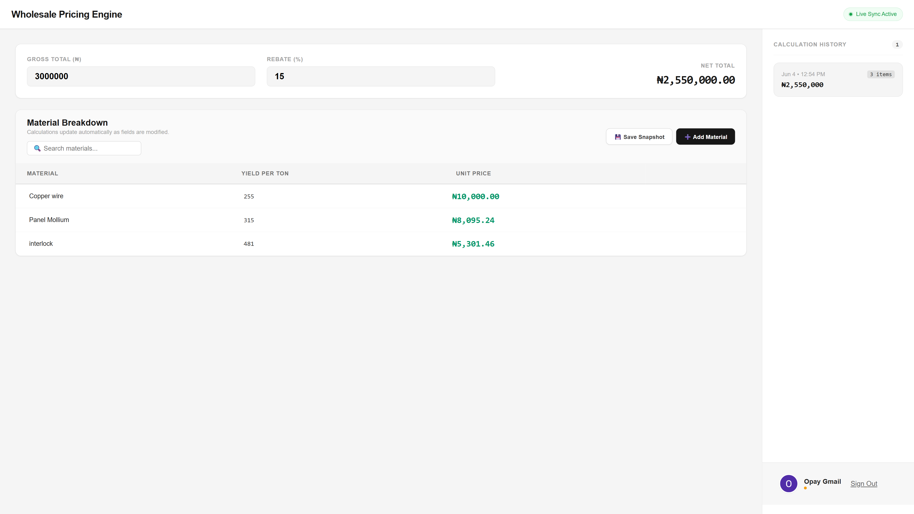
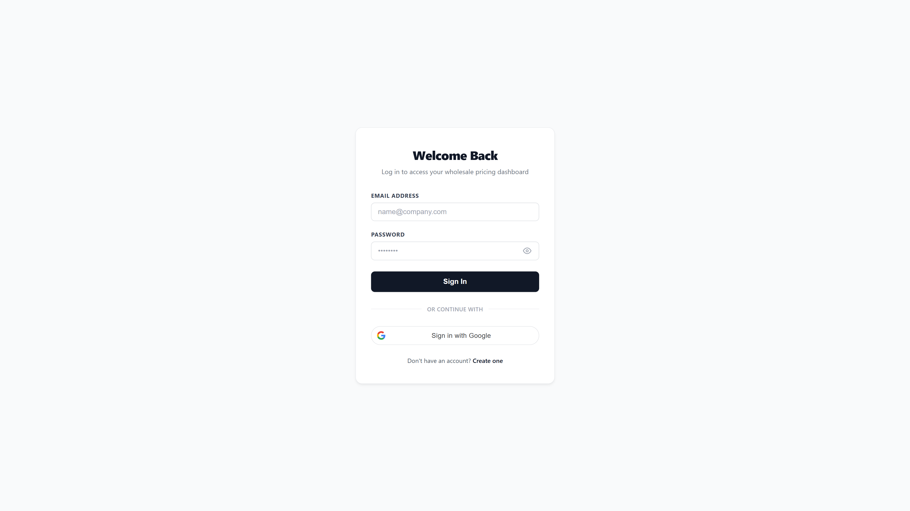

Wholesale Pricing Engine

A full-stack wholesale pricing and rebate management application that helps businesses calculate unit pricing, manage materials, and track historical pricing snapshots.

Live Demo

🚀 Live Application: [Add your Vercel URL here]

Screenshots
Dashboard

Add a screenshot of:

Gross Total
Rebate
Material table
Unit price calculations

Calculation History

Add a screenshot showing:

Sidebar
Saved snapshots
User account section

Authentication

Add a screenshot showing:

Login page
Google Sign-In
Clean UI

Features
User authentication with JWT
Google OAuth Sign-In
Email verification with OTP
Material CRUD operations
Real-time rebate calculations
Snapshot history tracking
Protected API routes
Responsive design
Tech Stack
Frontend
React
React Router
Axios
Vite
Backend
Node.js
Express.js
MongoDB
Mongoose
Authentication & Security
JWT
Google OAuth
Bcrypt
OTP Email Verification
Deployment
Vercel (Frontend)
Render (Backend)
MongoDB Atlas (Database)
Architecture
React Frontend
       │
       ▼
Express API
       │
       ▼
MongoDB Atlas
Key Technical Challenges Solved
Authentication Persistence

Implemented automatic session restoration using JWT access tokens and refresh tokens.

OAuth Integration

Integrated Google Sign-In with account linking and profile synchronization.

Protected Routes

Built middleware-based authentication for securing user-specific resources.

Snapshot System

Designed a history tracking system that stores rebate calculations for future reference.

Local Setup
git clone https://github.com/rhokeebsanni/rebate-calculator.git

cd frontend
npm install
npm run dev

Backend:

cd server
npm install
npm run dev
Author

Rhokeeb Sanni

GitHub: @rhokeebsanni
